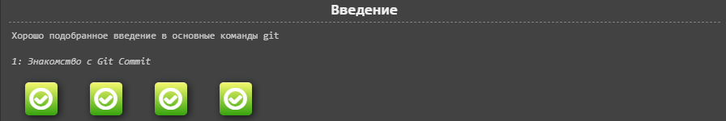
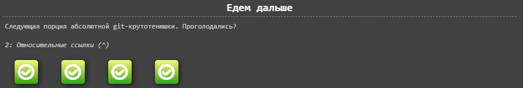
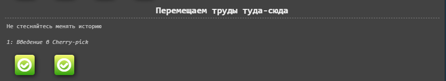
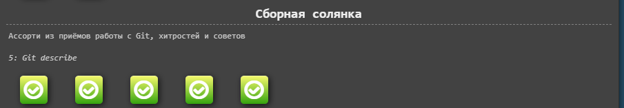
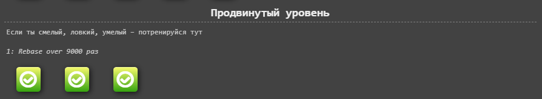
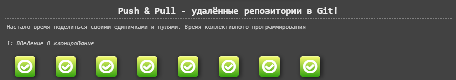
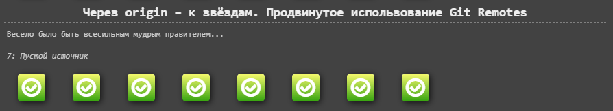

# Основы

## Введение

## Едем дальше

## Перемещаем труды туда-сюда

## Сборная солянка

## Продвинутый уровень

# Удаленные репозитории
## Push & Pull - удалённые репозитории в Git!

## Через origin – к звёздам. Продвинутое использование Git Remotes

