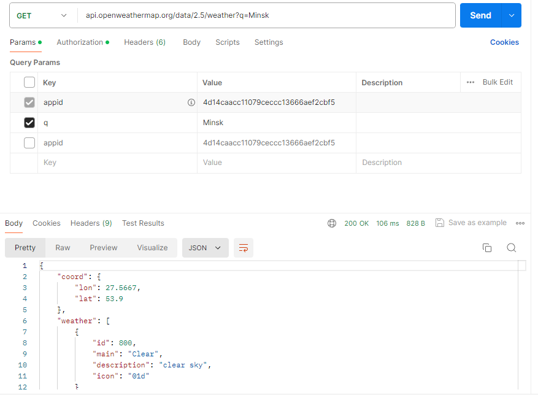
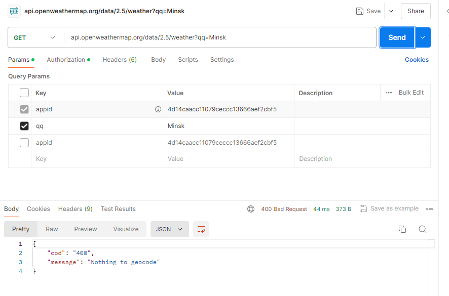
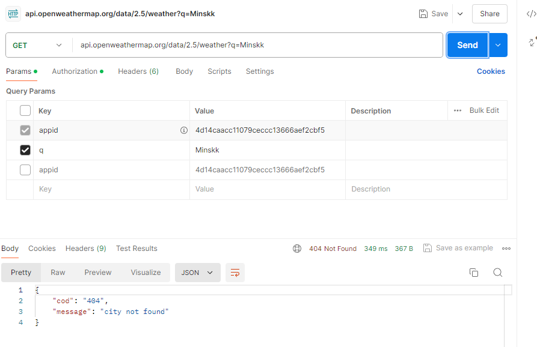

# Информационные ответы (100-199)
Код коды от 100 до 199 являются промежуточными и поэтому они при обычных запросах не отображаются

# Успешные ответы (200-299)
Запрос успешно выполнен.

# Сообщения о перенаправлении (300-399)
Чтобы получить 300-399 коды нужно обратиться к перенесённому сайту

# Ошибки клиента (400-499)

## 400 Bad Request 

## 401 Unauthorized 

## 404 Not Found 

# Ошибки сервера (500 - 599)
Код 500 можно получить только при внутренней ошибке сервера, что невозможно сделать используя OpenWeatherMap API, так как сервер онлайн
